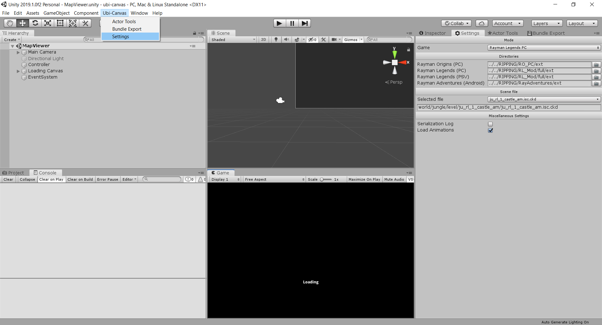

# ubi-canvas
Level viewer and editor for UbiArt games such as Rayman Legends and Rayman Adventures

## Current support
- Rayman Legends (PC): viewing & editing
- Rayman Adventures (Android): viewing
- Rayman Origins (PC): limited viewing

## How to use
1. Download and install Unity 2019
2. Clone this project and open it with Unity
3. Open the MapViewer scene (located in Assets/Scenes/)

4. In the hierarchy (on the left), select the Controller object. In the inspector (right), you can configure the following paths:
   - GameDataBin Folder: The path to the itf_cooked/pc folder. Note: all ipk files should be extracted to the same directory, including fullLogic.
   - Path folder: The path (without file) to the scene file, relative to the GameDataBin Folder, e.g. `world/home/level/petroom/`
   - Path file: The filename of the scene file, e.g. `pet_room.isc.ckd`
5. Make sure the correct mode is selected too, e.g. Rayman Legends PC.
5. If you want to load animations, check the relevant checkbox, otherwise uncheck it. Since loading is slow, there will be a major speed boost if you uncheck it.
6. Make sure "Maximize on Play" is unchecked (you will want to see the hierarchy and inspector) in the game view tab.
7. Click the play button and wait for it to load.
8. Have fun!

## Controls
- Game view: Shift to toggle camera controls, and WASD to move around after that. Press L to toggle lighting on/off.
- Scene view: Hold the right mouse button and use WASD to move around

## Misc tips
- I have not checked every scene. If there is an error, please let me know and I will do my best to fix it ASAP.
- Sometimes, you won't see anything in game view or things will be obscured. Press L to disable and enable lighting.
- To play different animations, navigate to the actor in the hierarchy and if it has animations, there will be a "skeleton" under it. Select it and use the relevant controls in the inspector to select a different animation.
- To add an actor from an act file to the scene, go to Window -> Add Actor while the scene is loaded. Fill in the path to the .act.ckd file relative to the GameDataBin folder. In the hierarchy, make sure to select the Scene object that you want to add the actor to, and click Load.
- To write a patch IPK file (this only works on Rayman Legends for now), go to Window -> Write Bundle while the scene is loaded. Select all the files you have edited and want to store in the patch bundle. Fill in the absolute path to the patch_PC.ipk file (this time including the filename), and write it. When it's ready, put it in the game folder and test your edits in-game!